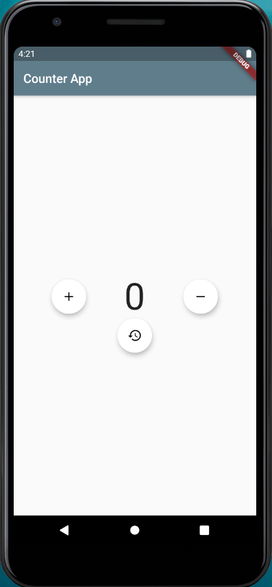
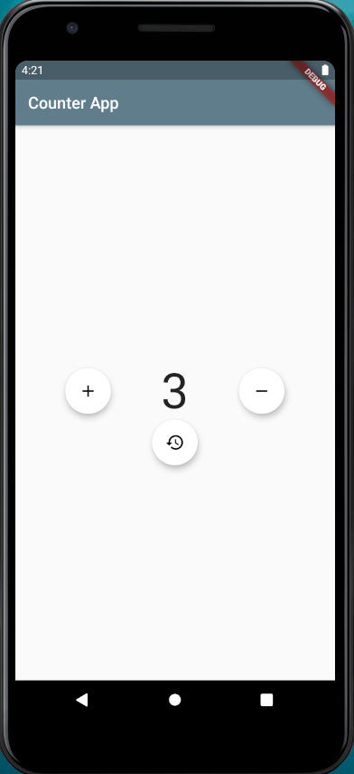

# Counter_app_flutter

### About the app
<b>Built Using</b>
<ul><li>Flutter</li></ul>

This flutter app contains three buttons '+','-' and 'reset' button.
<ul>
  <li>
    When the user clicks the <b>'+'</b> button the value of the counter variable will be increasing by one and it will be displayed with a setState widget used.
  </li>
  <li>
    When the user clicks the <b>'-'</b> button the value of the counter variable will be decreasing by one and it will be displayed with a setState widget used.
  </li>
  <li>
    When the user clicks the <b>'reset</b> button the value of the counter variable will be reset to <b>0</b> and it will be displayed with a setState widget used.
  </li>
  <li>
    Things which are done in the app involves:
    <ol>
      <li>MaterialApp class/design.</li>
    <li>Scaffold Class.</li>
    <li>AppBar.</li>
    <li>Icon and name change.</li>
    <li>Use of functions and variables.</li>
    <li>Stateless and Stateful widget.</li>
    </ol>
  </li>
  
</ul>

<b>Some Snaps from the App:-</b>

 &nbsp; &nbsp;  &nbsp; &nbsp; &nbsp; &nbsp;  &nbsp; &nbsp;
 &nbsp; &nbsp;  &nbsp; &nbsp; &nbsp; &nbsp;  &nbsp; &nbsp;

<b>Watch the project video here:- <a href="https://user-images.githubusercontent.com/67725607/111067242-6a43b280-84e9-11eb-84a1-fdd221cc9d21.mp4">Counter App</a></b>

## Show some ❤️ and ⭐ the repo if you find it useful.
 ### Getting Started
This project is a starting point for a Flutter application.
 
A few resources to get you started if this is your first Flutter project:
<ul>
 <li>
  <a href="https://flutter.dev/docs/get-started/codelab">Lab: Write your first Flutter app</a>
 </li>
 <li>
  <a href="https://flutter.dev/docs/cookbook">Cookbook: Useful Flutter samples</a>
 </li>
 </ul>
For help getting started with Flutter, view our <a href="https://flutter.dev/docs">online documentation</a>, which offers tutorials, samples, guidance on mobile development, and a full API reference.
